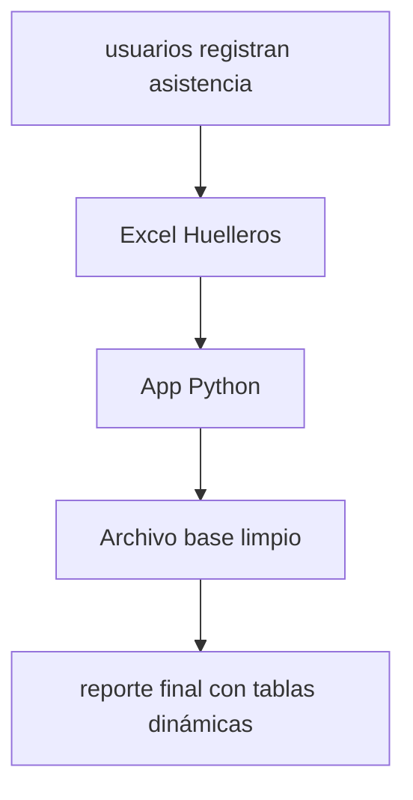

# BIOMETRICOS
Proyecto de automatización de reportes de asistencia laboral

## Empaquetamiento
Actualmente el proyecto está diseñado para ser ejecutado como un achivo .exe. Para empaquetarlo siga los siguientes pasos:

### Paso 1
Instale Oracle instrant client (version 19.30)


### Paso 2
Mueva la carpeta de Oracle Instant Client dentro de la carpeta raíz del proyecto (asegurese de que la carpeta se llame *"instantclient_19_30"*)


### Paso 3
ejecute el siguiente comando en la carpeta raíz del proyecto:
```
pyinstaller --onefile --noconsole --add-binary "instantclient_19_30;instantclient" --hidden-import getpass --name BiometricosApp main.py
```
Esto debe crear un archivo .exe en una carpeta llamada dist/ dentro del proyecto


##  Arquitectura del flujo


## Tecnoligías usadas
### python v 3.x
---
**librerias:**
- pandas 
- openpyxl
- oracledb
- XlsxWriter
- tkcalendar 
### Oracle Instant Client v.19.30
---
El proyecto ya tiene incluida la carpeta con Oracle Instant Client

---
## Estructura del proyecto
	/BIOMETRICOS
		|-app/ 			-UI y controlador
		|	|ui.py					-Interfaz de usuario
		|	|controller.py			-Controlador de la aplicación
		|-config/ 		
		|	|config.py				-Configuración del sistema
		|-Controller/	-Lógica de negocio
		|	|agrupaciones.py		-Funciones de agrupación y cruce de dataframes
		|	|procesamiento.py		-Proceso principal del sistema
		|	|reglas.py				-Validaciones y verificaciones
		|	|transformaciones.py	-Funciones de transformación de datos
		|-Data/			-Extracción y lectura de datos externos
		|	|loader.py				-Consulta a la base de datos de empleados
		|	|security.py			-Encriptación y desencriptación de claves
		|-Excel/		
		|	|exportador.py			-Exportador de dataframe a Excel
		|-SQL/
		|	|query_empleados.py		-Texto para la consulta de datos de empleados activos
		|main.py					-flujo principal del sistema
		|requirements.txt			-dependencias de python a instalar

