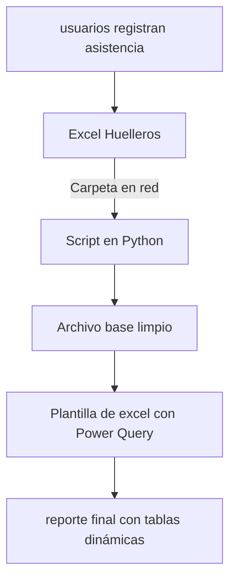

# Automatización de Biométricos

## Descripción

Este proyecto automatiza el procesamiento de registros de huelleros (biométricos), integrando múltiples fuentes de datos (Excel y base de datos Oracle) para generar un reporte consolidado de asistencia de empleados.

El sistema reemplaza un proceso manual intensivo mediante un flujo automatizado que limpia, transforma y consolida los datos, y los integra con una plantilla de Excel con tablas dinámicas.

---

##  Objetivo

- Automatizar la consolidación de marcaciones biométricas
- Reducir errores manuales
- Generar reportes consistentes y reproducibles
- Facilitar el análisis de asistencia del personal

---

##  Arquitectura del flujo

##  Dependencias

Para el correcto funcionamiento de esta automatización se requiere tener instalados en el computador donde se ejecutarán los reportes:
### python v 3.x
---
**librerias:**
- pandas 
- openpyxl
- oracledb

### Oracle Instant Client v.19.30
---
Una vez instalado mover la carpeta a **"C:\Oracle"**. Asegurarse de que la carpeta tenga como nombre ***"instantclient_19_30"***

---
## Estructura del proyecto
	/BIOMETRICOS
		|-Huelleros/ 	-Archivos de entrada (DIT, CASETA,ADMIN)
		|-SQL/ 			-Script SQL
		|-Scripts/		-Código Python
		|-Excel/		-Archivos de excel (archivo base y plantilla)
		|-README.md
